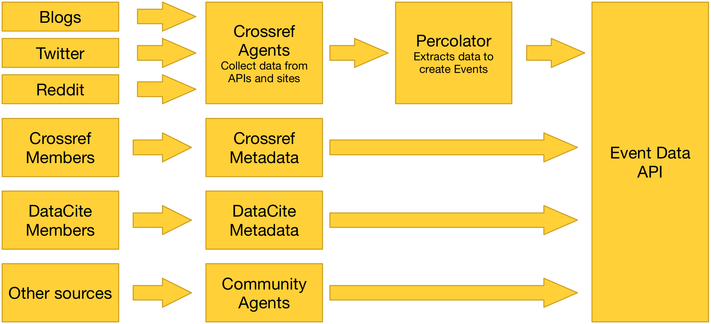

# About the Data

The Crossref Event Data is centred around Events, but contains supporting data and metadata. You will find:

 - Events, which record activity
 - Evidence Records, which provide an evidence trail
 - Artifacts, which show some of the inputs that were used
 - Reports, which document the behaviour of the system

This section describes in detail exactly what data exists in CED, and what you should bear in mind when using it.

## Why Events?

The Event Data service includes data from a diversity of sources and styles. TODO

## Where the data comes from

Data comes from different sources, via different routes. For some sources, like Crossref Metadata and DataCite Metadata, we receive Events directly from the source. For others, we operate a bot to go and look for Events.

Events from each source go on a different journey to get into Event Data. Each Event documents its own provenance and links to evidence, where applicable. 

Because of the diversity of routes by which data enters CED, you should consider which sources you are interested in. The 'Sources' section documents each in detail.

## What kind of data?

Crossref Event Data is a system for capturing data about non-traditional interactions with scholarly literature. Most of these take the form of links between webpages and articles that have DOIs. 

"Webpages" represent a wide variety of things. CED is interested in non-traditional scholarship, so the bot avoids websites that belong to members of Crossref and DataCite. We maintain a list of domains that the Event Data Bot will not visit because we know they belong to Publishers. This exclusion is done on a best-effort basis.

We exclude other webpages that we believe are part of databases, library systems etc. As we monitor a potentially limitless set of websites, this with is done with heuristics, again on a best-effort basis.

## Data Sources

Event Data is a hub for the collection and distribution of a variety of Events and contains data from a selection of Data Sources. Every Event is produced by an Agent operated by Crossref, DataCite or one of our partners. The Agent is responsible for connecting to an external Data Source and turning the data into Events. In some cases, the Agent is passing data through and in other cases the Agent has to do some work to extract the Event.

You may find that a (`subject`, `relation`, `object`) triple may occur in more than one source. For example, a blog post that's captured by the Wordpress.com agent might also be included in an RSS feed monitored by the Newsfeed agent, and might also be captured by the Web agent. In this case there might be three Events that have the same blog url subject and DOI object.

Each source has a degree of specificity. For example, the Wordpress.com Agent assumes that it is following blog pages and therefore record the subject as a 'blog', but the Web Agent can make no assumptions about generic webpages, and so may record the blog as as simply a 'webpage'. You will need to interpret this kind of data, for example by de-duplicating duplicates, or by treating duplicates as extra corroboration.

For detailed discussion of each Agent, see its corresponding page.

| Name                   | Source Identifier   | Provider    | What does it contain? |
|------------------------|---------------------|-------------|------------------|
| [Crossref metadata](sources/crossref)   | crossref   | Crossref    | Dataset citations from Crossref Items to DataCite Items |
| [DataCite metadata](sources/datacite)   | datacite   | DataCite    | Dataset citations from DataCite Items to Crossref Items |
| [Newsfeed](sources/newsfeed)               | newsfeed            | Crossref    | Links to Items on blogs and websites with syndication feeds |
| [Reddit](sources/reddit)                 | reddit              | Crossref    | Mentions and discussions of Items on Reddit |
| [Twitter](sources/twitter)                | twitter             | Crossref    | Links to Items on Twitter |
| [Web](sources/web)                    | web                 | Crossref    | Links of Items on web pages |
| [Wikipedia](sources/wikipedia)              | wikipedia           | Crossref    | References of Items on Wikipedia |
| [Wordpress.com](sources/wordpress-dot-com)          | wordpressdotcom     | Crossref    | References of Items on Wordpress.com blogs |

Every Data Source exists for a different reason, and therefore provides a different style of data. Every Agent operates slightly differently, according to its source. When you consume Events you should be mindful of the source they came from and the Agent that processed them.