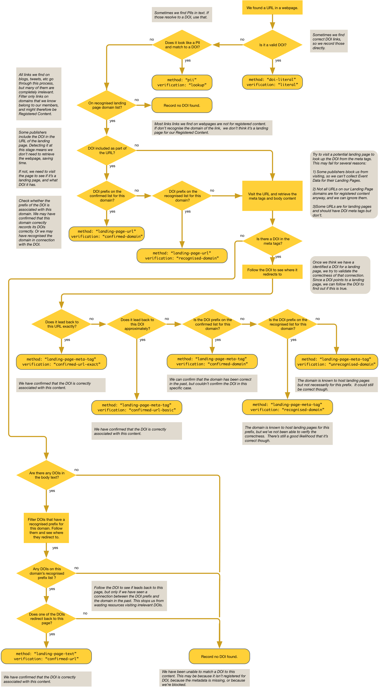

# Matching Landing Pages to DOIs

Crossref Agents gather data from exernal APIs, and where they spot a link to a URL to a potential Landing Page they pass it onto the Percolator. The Percolator follows a multi-step process to try and work out the DOI for the page and verify it as accurately as possible. The optional `obj.method` and `obj.verification` fields record which path was taken.

Because of the diversity of inputs we get and landing pages we find, this process will never be perfect. It is done on a best-effort basis, and we have a number of techniques for doing the match. The methods we use to extract the DOI and to verify the match range from broad to specific, and from highly accurate to less accurate. 

The detail on how the match was made and validated is included in Events (as of September 2018). You can choose which Events you want to use for your purpose.

# How it works

The Percolator has a few methods available. The first method is to look for the DOI embedded in the URL. This happens quite often, e.g. PLOS:

    http://journals.plos.org/plosone/article?id=10.1371/journal.pone.0160617

There are other similar methods to this. If we are unable to get the DOI from the URL, we will visit the URL. If the landing page has the correct metadata tags in the HTML, we will use that. e.g. from the same PLOS Page:

    <head>
      <meta name="dc.identifier" content="10.1371/journal.pone.0160617" />
    </head>

Failing that, as a method of last resort, we look in the page text for DOIs. According to the display guidelines that all Crossref members agree to, they should display the DOI on every landing page to identify the content. Because landing pages can contain many DOIs (e.g. to display reference lists), we have to carefully verify that the DOI does indeed point back to that landing page. This check can meet with problems, for example, if the publisher blocks robots from accessing their pages. 

The method is described in the Event's `subj.method` field. It can be one of the following, in order of preference:

 - `doi-literal` - The input was actually a DOI, no need to convert. This is most reliable.
 - `pii` - The input was a PII ([Publisher Item Identifier](https://en.wikipedia.org/wiki/Publisher_Item_Identifier)). We used our own metadata to map this into a DOI.
 - `landing-page-url` - We looked at the URL and extracted the DOI directly. For example, PLOS URLs include the DOI as a URL parameter.
 - `landing-page-meta-tag` - We visited the webpage and found a meta tag, eg. `dc.identifier`, indicating the DOI.
 - `landing-page-page-text` - We visited the webpage and found a DOI in the body text and we think this is the DOI for this page. This is the least reliable.

# Verification

We monitor DOIs for  Crossref and DataCite across all DOI prefixes. We follow a sample of DOIs per prefix to see where they lead. From this sampling, we build a dataset that describes:

 - the list of domains that we recognise as belonging to members
 - the list of prefixes
 - which DOI prefixes redirect to which domain names
 - which DOI prefixes redirect to which domain names, where the landing page correctly records its DOI in the HTML metadata.

This is detailed in the [domain-doi-decision-structure](/data/artifacts) Artifact. Using this dataset we can determine:

 - Which domains have we confirmed to correctly indicated their DOI.
 - Which domains we recognise as being connected to which DOI prefixes.
 - Which domains generally have DOIs registered.

When we match a Landing Page Domain to a DOI, we try to verify it using the following measures:

 - `literal` - The URL is a DOI, so no need to validate. This is the most reliable.
 - `lookup` - We looked up the PII in our own metadata, and we trust that.
 - `checked-url-exact` - We visited the DOI and it led back to precisely the same URL. 
 - `checked-url-basic` - We visited the DOI and it led back to almost the same URL. The protocol (http vs https), query parameters or upper / lower case may be different. This can happen if tracking parameters are automatically added by the website meaning the URLs are no longer identical. 
 - `confirmed-domain-prefix` - On previous occasions we have seen that DOIs with the given prefix (e.g. "10.5555") redirect to webpages with the same domain (e.g. "www.example.com") and those websites correctly report their DOIs in meta tags. Only the domain and DOI prefix are considered.
 - `recognised-domain-prefix` - On previous occasions we have seen that DOIs with the given prefix (e.g. "10.5555") redirect to webpages with the same domain (e.g. "www.example.com"). Those websites do not always correctly report their DOIs in meta tags. Only the domain and DOI prefix are considered.
 - `recognised-domain` - On previous occasinos we have seen that this domain is associated with DOIs in general. This is the least reliable.

This level of detail and verification was introduced in version 0.6.2 of the Percolator in September 2018. Before this date you can assume that 'method' is one of:

 - `pii`
 - `doi-literal`
 - `landing-page-url`
 - `landing-page-meta-tag`

and 'verification' is `recognised-domain`.

# Process in detail

The process that we use for matching landing pages to DOIs is detailed in this flow chart, also [available as a PDF](../images/landing-page-flow.pdf):

